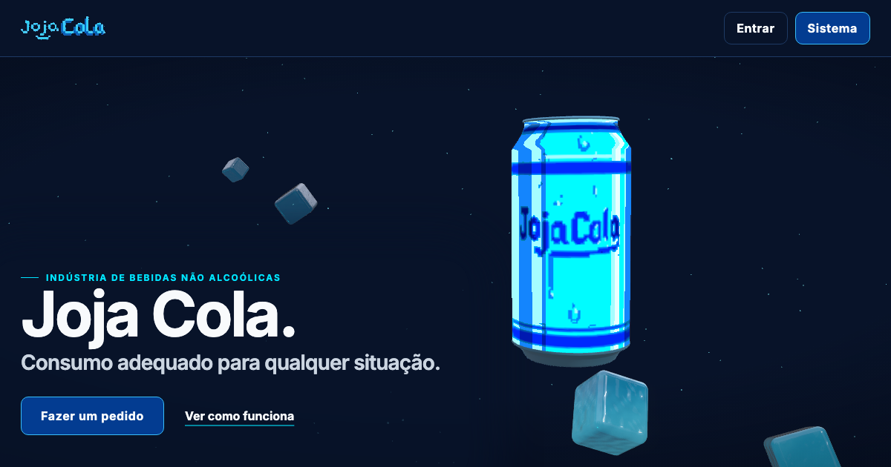

# Joja Cola

Landing page e sistema de pedidos de uma marca fictícia de refrigerante. A página inicial é uma cena 3D contínua: a lata acompanha o scroll de seção em seção, brinda com outra lata em "O acompanhamento", congela em "Gelada" e entra e sai dos celulares do app.

**Ao vivo:** https://andrebrumdev.github.io/joja-cola/



## Stack

- React 19 + Vite + TypeScript
- React Three Fiber, drei e postprocessing (cena 3D, cubos de gelo em vidro, bloom)
- GSAP + ScrollTrigger (entrada, scroll e seções fixadas)
- Motion (telas internas do sistema) e MapLibre (rotas)

## Rodando

```bash
npm install
npm run dev      # http://localhost:5173
npm run build    # gera dist/ para o GitHub Pages
```

`prefers-reduced-motion` troca a cena 3D pelas latas em pixel art, sem animação.

## Assets da lata

O modelo e o rótulo em `public/models/` são gerados por scripts (Python 3 com `numpy` e `Pillow`):

- `scripts/build-can-label.py` recria o rótulo a partir de `src/assets/can.png`, nas coordenadas UV do modelo.
- `scripts/slim-can-model.py` remove as texturas não usadas do `.glb` e reduz as restantes a 512 px (2,9 MB → 0,4 MB).

## Acesso ao sistema

Projeto de demonstração acadêmica: o login aceita qualquer e-mail e senha não vazios e não há backend.
